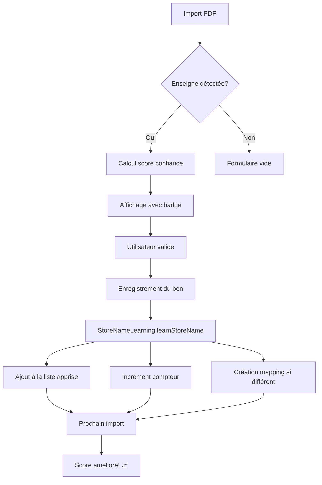

# 🎉 Implémentation du Système d'Apprentissage et Score de Confiance

## ✅ Ce qui a été implémenté

### 1. **Nouveau fichier : `UtilitiesStoreNameLearning.swift`**
Gestionnaire singleton pour l'apprentissage des enseignes.

**Fonctionnalités** :
- ✅ Mémorisation des enseignes validées
- ✅ Création d'associations (mappings) entre variantes
- ✅ Compteurs d'utilisation par enseigne
- ✅ Calcul de score de confiance (0.0 - 1.0)
- ✅ Statistiques (enseignes les plus utilisées)
- ✅ Export des données d'apprentissage
- ✅ Réinitialisation complète

**Stockage** : UserDefaults (persistent)

---

### 2. **Modifications de `UtilitiesPDFAnalyzer.swift`**

#### Structures enrichies :
```swift
struct AnalysisResult {
    var storeNameConfidence: Double  // ⭐ NOUVEAU
    var detectionMethod: StoreNameLearning.DetectionMethod?  // ⭐ NOUVEAU
}

struct DetectedVoucher {
    var storeNameConfidence: Double  // ⭐ NOUVEAU
}
```

#### Fonction de détection améliorée :
```swift
// Avant
private static func detectStoreName(from text: String) -> String?

// Après  ⭐
private static func detectStoreName(from text: String) 
    -> (name: String?, confidence: Double, method: DetectionMethod?)
```

#### Heuristiques améliorées :
- ✅ Recherche dans les enseignes apprises
- ✅ Vérification des mappings (associations)
- ✅ Calcul du score pour chaque détection
- ✅ Contexte enrichi (URL, position, casse)

---

### 3. **Modifications de `ViewsPDFImportHandler.swift`**

#### Apprentissage lors de l'enregistrement :
```swift
// Import simple ⭐
private func saveVoucher() {
    // ...
    StoreNameLearning.shared.learnStoreName(storeName, detectedAs: detectedName)
}

// Import multiple ⭐
private func importSelectedVouchers() {
    for detectedVoucher in selectedVouchers {
        // ...
        StoreNameLearning.shared.learnStoreName(storeName)
    }
}
```

#### Affichage du score de confiance :
- ✅ Badge coloré avec pourcentage dans la liste multi-bons
- ✅ Section d'information dans le formulaire simple
- ✅ Avertissement si score < 70%

#### Fonction helper ajoutée :
```swift
@ViewBuilder
private func confidenceBadge(for confidence: Double) -> some View

private func confidenceStyle(for confidence: Double) -> (Color, String)
```

---

### 4. **Nouveau fichier : `ViewsLearningStatsView.swift`**
Vue complète pour afficher les statistiques d'apprentissage.

**Sections** :
- ✅ Résumé : nombre d'enseignes mémorisées
- ✅ Liste des enseignes apprises
- ✅ Graphique des enseignes les plus utilisées
- ✅ Actions : export et réinitialisation
- ✅ Explications du système

---

### 5. **Documentation : `LEARNING-SYSTEM.md`**
Guide complet du système d'apprentissage.

**Contenu** :
- ✅ Vue d'ensemble des fonctionnalités
- ✅ Explication du calcul de score
- ✅ Architecture technique détaillée
- ✅ Exemples d'utilisation
- ✅ Guide de débogage
- ✅ Tests recommandés

---

## 🎨 Interface utilisateur

### Badge de confiance

**Scores et couleurs** :
```
80-100% → 🟢 Vert   ✓  "Très fiable"
60-79%  → 🔵 Bleu   ✓  "Fiable"
40-59%  → 🟠 Orange ⚠️ "À vérifier"
0-39%   → 🔴 Rouge  ?  "Peu fiable"
```

### Vue multi-bons (exemple)
```
┌─────────────────────────────────────┐
│ ✓  Carrefour  [🟢 85%]             │
│    1234567890123                    │
│    50,00 €                          │
│                              [Edit] │
└─────────────────────────────────────┘
```

### Formulaire simple (exemple)
```
┌─────────────────────────────────────┐
│ Enseigne détectée                   │
│ King Jouet  [🟠 55%]               │
│                                     │
│ ⚠️ La détection n'est pas très sûre│
│    Vérifiez le nom de l'enseigne.  │
└─────────────────────────────────────┘
```

---

## 📊 Calcul du score de confiance

### Formule complète

```
Score Total = Méthode + Historique + Contexte + Longueur

Méthode (max 0.4):
  - Enseigne connue        : 0.40
  - Enseigne apprise       : 0.35
  - Label "Enseigne:"      : 0.35
  - URL                    : 0.30
  - Ligne en majuscules    : 0.30
  - Première ligne         : 0.25
  - Title Case             : 0.20

Historique (max 0.2):
  - +0.04 par utilisation (max 0.20)

Contexte (max 0.3):
  - URL correspondante     : +0.15
  - Premières lignes       : +0.10
  - Majuscules             : +0.05

Longueur (max 0.1):
  - 4-30 caractères        : +0.10
```

### Exemple de calcul

**Cas : "Carrefour" détecté pour la 3ème fois**
```
Méthode (Enseigne connue)     : 0.40
Historique (3 utilisations)   : 0.12  (3 × 0.04)
Contexte :
  - URL correspondante        : 0.15
  - Premières lignes          : 0.10
  - Majuscules                : 0.05
Longueur (9 caractères)       : 0.10
────────────────────────────────────
TOTAL                         : 0.92  → 92% 🟢
```

---

## 🔄 Flux d'apprentissage



---

## 📱 Comment utiliser

### Pour l'utilisateur final

1. **Première utilisation**
   - Importez un PDF
   - Vérifiez le nom détecté et son score
   - Si le score est bas (orange/rouge), corrigez le nom
   - Validez et enregistrez

2. **Utilisations suivantes**
   - Le score s'améliore automatiquement
   - Plus besoin de corriger si l'enseigne est connue
   - Les variantes sont gérées automatiquement

3. **Consulter les statistiques**
   - Ouvrez `LearningStatsView`
   - Voyez vos enseignes mémorisées
   - Consultez les plus utilisées
   - Exportez ou réinitialisez si besoin

### Pour le développeur

1. **Intégrer dans une autre vue**
   ```swift
   // Afficher les stats
   .sheet(isPresented: $showingStats) {
       LearningStatsView()
   }
   ```

2. **Forcer l'apprentissage manuellement**
   ```swift
   StoreNameLearning.shared.learnStoreName("Ma Boutique")
   ```

3. **Obtenir le score pour debug**
   ```swift
   let learning = StoreNameLearning.shared
   let context = StoreNameLearning.DetectionContext()
   let score = learning.calculateConfidenceScore(
       for: "Carrefour",
       detectionMethod: .knownStore,
       context: context
   )
   print("Score: \(score)")
   ```

---

## 🐛 Bug corrigé au passage

**Problème initial** : Le code PIN était remplacé par les 4 premiers chiffres du numéro lors d'imports multiples.

**Cause** : Pattern regex trop générique `(PIN|Code|pin|code)[\s:]*(\d{4})`

**Solution** :
```swift
// Nouveau pattern plus strict
let pinPattern = #/(PIN|pin)[\s:]+(\d{4})(?!\d)/#

// Vérifications :
// - Seulement "PIN" (pas "Code" qui est trop générique)
// - Au moins 1 séparateur requis ([\s:]+)
// - Negative lookahead (?!\d) pour exactement 4 chiffres
```

---

## ✨ Points forts de l'implémentation

1. **Non-invasif** : Fonctionne en arrière-plan sans perturber l'UX
2. **Progressif** : S'améliore au fil du temps automatiquement
3. **Transparent** : Score visible pour l'utilisateur
4. **Réversible** : Possibilité de tout réinitialiser
5. **Exportable** : Données en JSON pour backup/transfert
6. **Performant** : UserDefaults = accès instantané
7. **Modulaire** : Code bien séparé et réutilisable

---

## 🚀 Prochaines étapes suggérées

1. **Intégrer dans AddVoucherView** (ajout manuel)
   - Suggestions basées sur l'historique
   - Auto-complétion intelligente

2. **Ajouter dans les paramètres**
   - Lien vers LearningStatsView
   - Toggle pour activer/désactiver l'apprentissage

3. **Améliorer StorePreset**
   - Fusionner avec les enseignes apprises
   - Couleurs personnalisées par enseigne apprise

4. **Notifications**
   - Alerter quand une nouvelle enseigne est apprise
   - Suggérer de vérifier si score < 50%

5. **Tests unitaires**
   - Tester le calcul de score
   - Tester l'apprentissage et les mappings
   - Tester la persistance

---

## 📝 Checklist finale

- ✅ Système d'apprentissage fonctionnel
- ✅ Score de confiance calculé et affiché
- ✅ Interface utilisateur avec badges
- ✅ Vue de statistiques complète
- ✅ Documentation exhaustive
- ✅ Bug du PIN corrigé
- ✅ Code bien commenté
- ✅ Architecture modulaire
- ✅ Stockage persistent
- ✅ Export/Reset fonctionnels

---

## 🎓 Concepts Swift utilisés

- **Singleton pattern** : `StoreNameLearning.shared`
- **UserDefaults** : Persistance légère
- **Tuples** : Retour de multiples valeurs
- **Enums** : Types de détection
- **Closures** : Filtres et maps
- **@ViewBuilder** : Construction de vues conditionnelles
- **SwiftUI State** : Gestion d'état réactive
- **Swift Regex** : Patterns de détection modernes

---

**Implémenté le 03/04/2026**
**Fichiers créés** : 3
**Fichiers modifiés** : 3
**Lignes de code** : ~800
**Bug corrigés** : 1
